# System Architecture - AI Document Summarizer

## High-Level Architecture

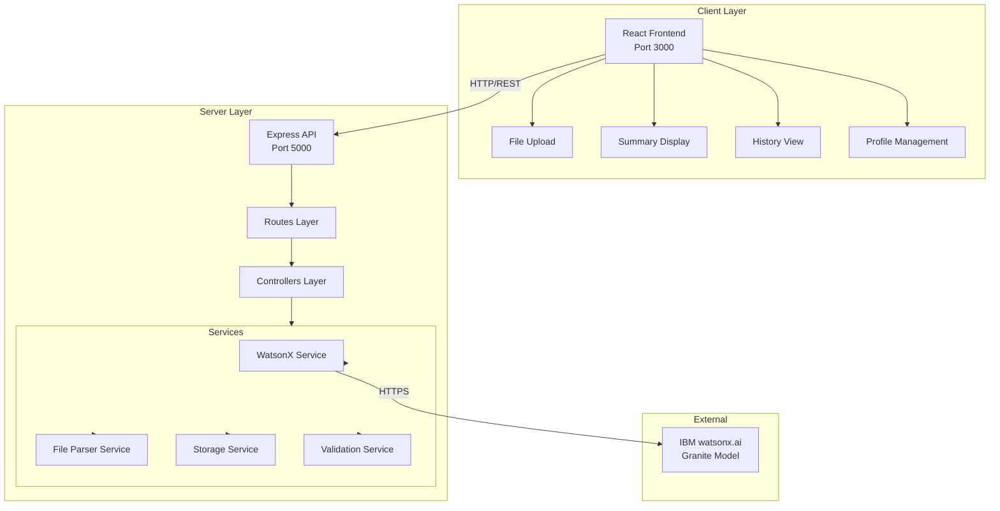

## Data Flow - Summary Generation

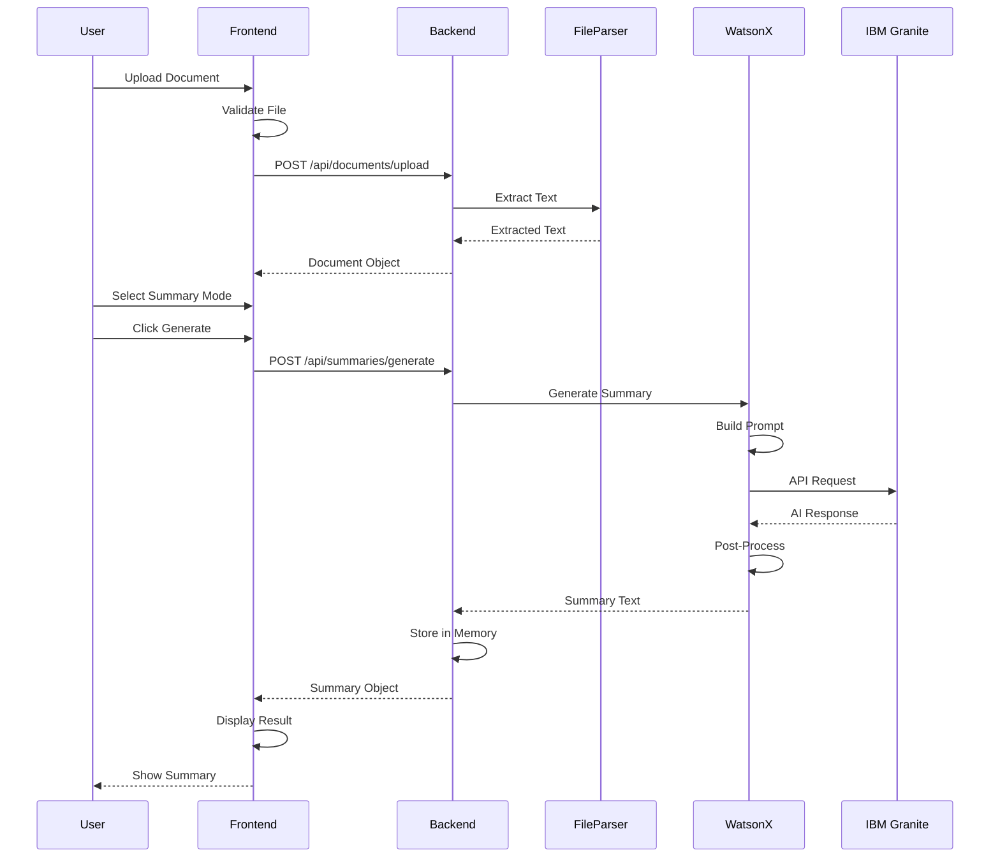

## Component Architecture - Frontend

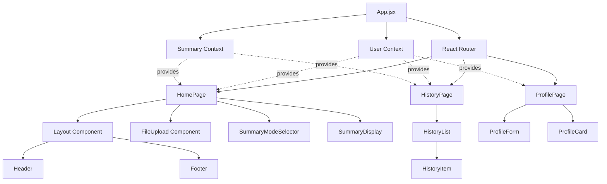

## Backend Structure

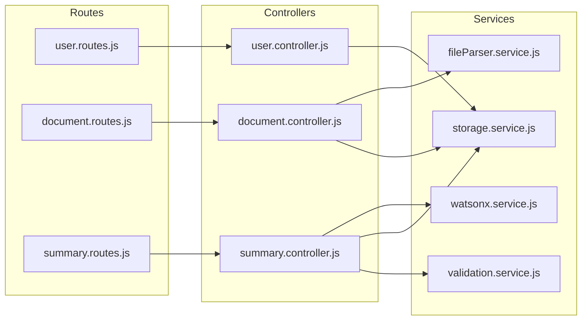

## Data Model Relationships

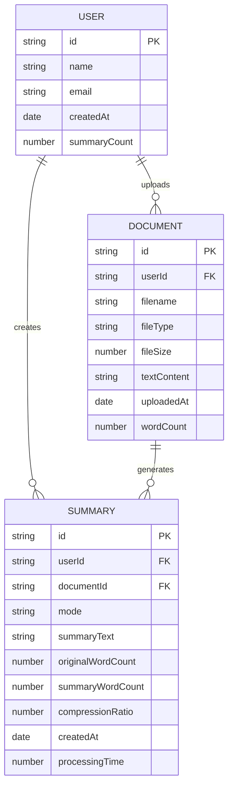

## State Management Flow

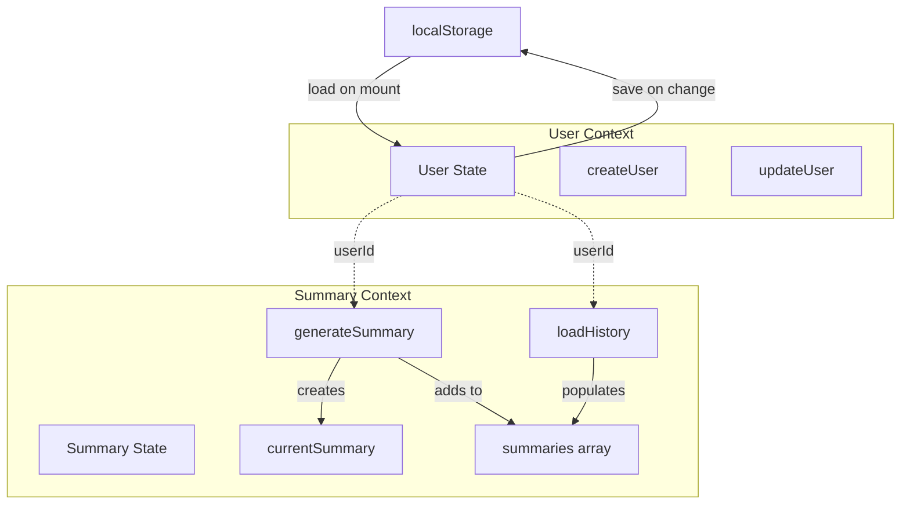

## API Request Flow

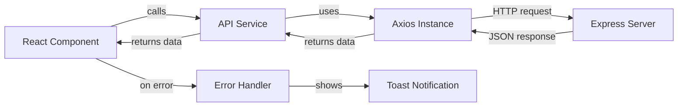

## File Upload Process

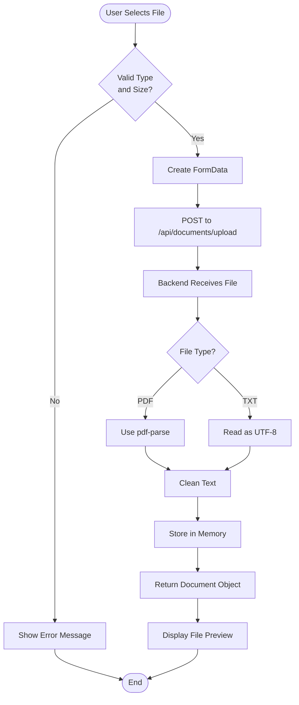

## Summary Generation Process

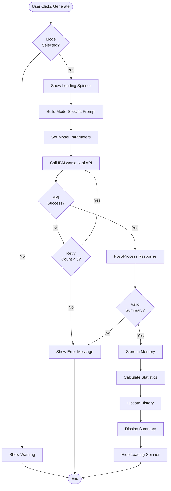

## Error Handling Strategy

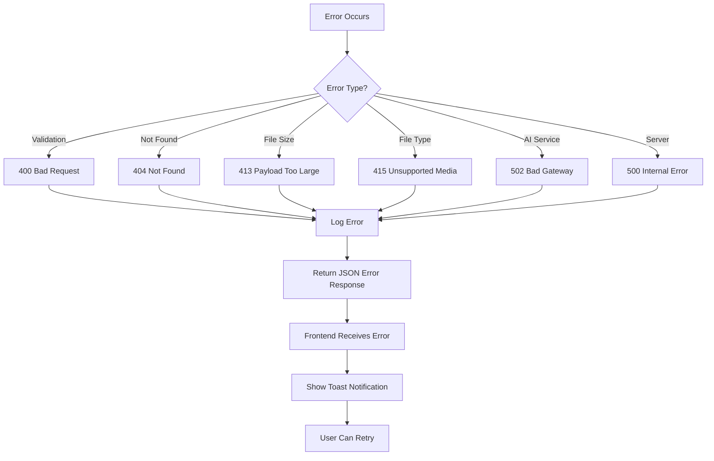

## Deployment Architecture

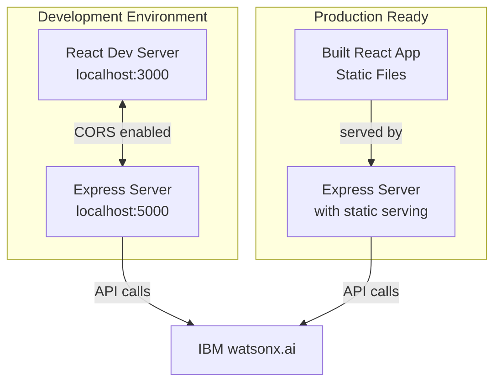

## Technology Stack Overview

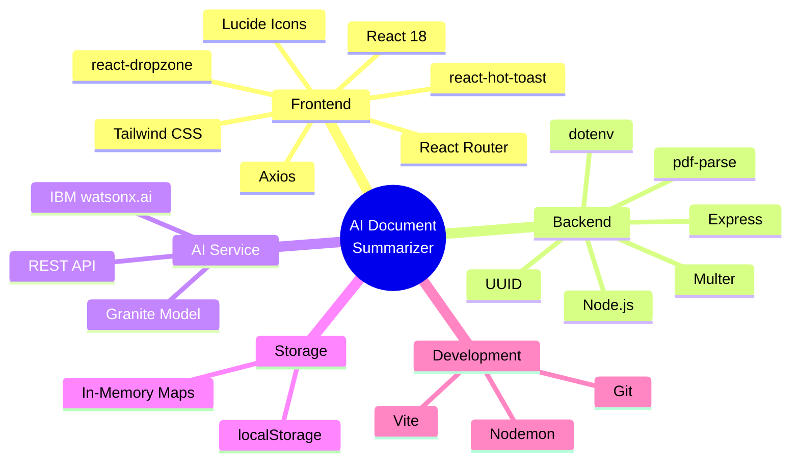

## Security Considerations

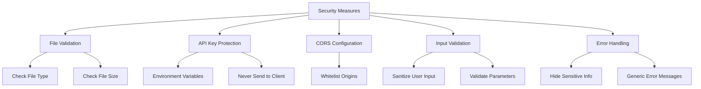

---

## Key Architectural Decisions

### 1. In-Memory Storage
**Decision**: Use JavaScript Maps for data storage  
**Rationale**: 
- Faster development (no database setup)
- Sufficient for demo/MVP
- Easy to migrate to database later
- No persistence needed for short demo

### 2. Context API for State
**Decision**: Use React Context instead of Redux  
**Rationale**:
- Simpler for small app
- Less boilerplate
- Sufficient for our needs
- Easier to understand

### 3. Monolithic Backend
**Decision**: Single Express server  
**Rationale**:
- Simpler deployment
- Easier development
- Sufficient scale for demo
- Can split later if needed

### 4. Client-Side Routing
**Decision**: React Router for navigation  
**Rationale**:
- Better UX (no page reloads)
- Easier state management
- Standard for SPAs

### 5. File Upload Strategy
**Decision**: Multer with memory storage  
**Rationale**:
- No disk I/O needed
- Faster processing
- Automatic cleanup
- Simpler implementation

---

## Scalability Considerations

### Current Architecture (MVP)
- In-memory storage
- Single server instance
- No caching
- Synchronous processing

### Future Enhancements
- Database (PostgreSQL/MongoDB)
- Redis caching
- Queue system for long documents
- Horizontal scaling
- CDN for static assets
- Rate limiting
- User authentication

---

## Performance Optimization

### Frontend
- Code splitting by route
- Lazy loading components
- Memoization for expensive operations
- Debounced search/filter
- Optimized re-renders

### Backend
- Response compression
- Request validation early
- Efficient text processing
- Connection pooling (future)
- Caching AI responses (future)

---

This architecture is designed to be:
- ✅ Simple to implement
- ✅ Easy to understand
- ✅ Quick to develop
- ✅ Ready to demo
- ✅ Scalable for future growth