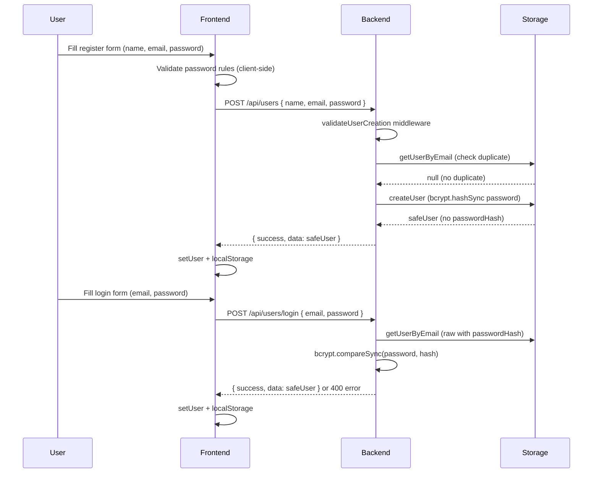
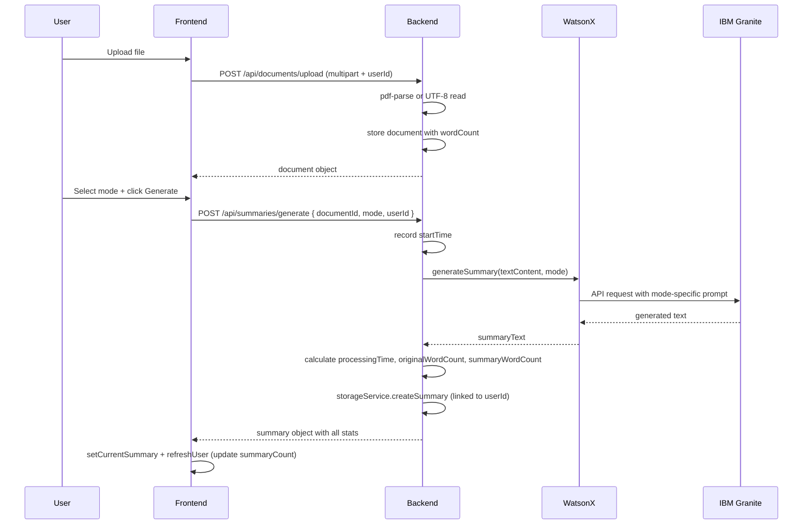
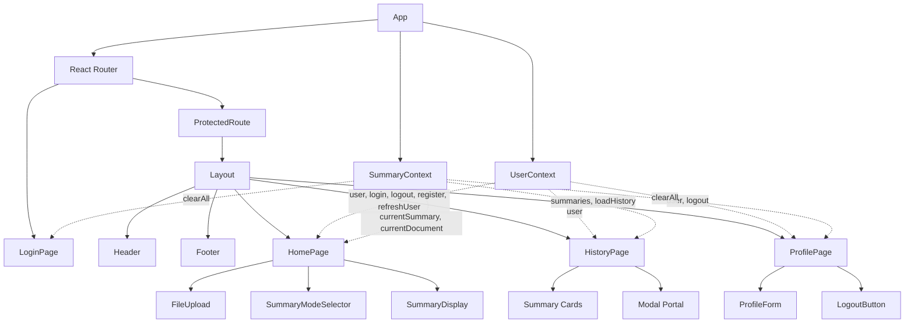
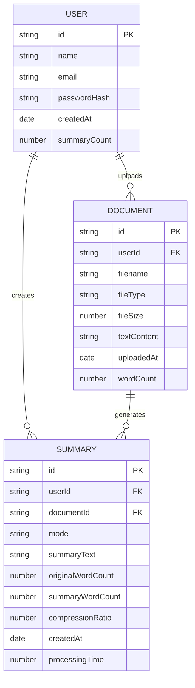
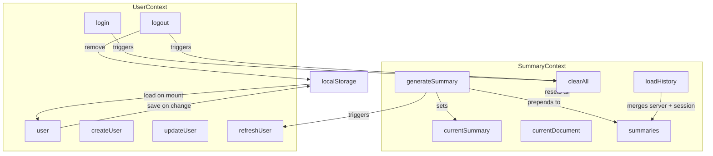

# System Architecture - AI Document Summarizer

## High-Level Architecture

```
┌──────────────────────────────────────────────────────────────┐
│                         CLIENT LAYER                          │
│   React Application (Port 5173)                               │
│   Login · Register · Summarize · History · Profile            │
└───────────────────────┬──────────────────────────────────────┘
                        │ HTTP/REST (Axios)
┌───────────────────────▼──────────────────────────────────────┐
│                        SERVER LAYER                           │
│   Express API (Port 5000)                                     │
│                                                               │
│   Routes → Controllers → Services                             │
│   ├── user.routes         user.controller                     │
│   ├── document.routes     document.controller                 │
│   └── summary.routes      summary.controller                  │
│                                                               │
│   Services                                                    │
│   ├── storage.service   (in-memory Maps + bcrypt)             │
│   └── watsonx.service   (IBM Granite integration)             │
└───────────────────────┬──────────────────────────────────────┘
                        │ HTTPS
┌───────────────────────▼──────────────────────────────────────┐
│                     EXTERNAL SERVICES                         │
│   IBM watsonx.ai — Granite Model                              │
└──────────────────────────────────────────────────────────────┘
```

---

## Authentication Flow



---

## Summary Generation Flow



---

## Frontend Component Architecture



---

## Data Model



> `passwordHash` is never returned by any API endpoint — stripped in every `getUser`, `createUser`, and `updateUser` response.

---

## State Management



---

## Backend Module Map

```
server/src/
├── controllers/
│   ├── user.controller.js
│   │   ├── createUser      POST /users        — hash password, check email dup
│   │   ├── loginUser       POST /users/login  — bcrypt compare, strip hash
│   │   ├── getUser         GET  /users/:id
│   │   └── updateUser      PUT  /users/:id
│   ├── document.controller.js
│   │   └── uploadDocument  POST /documents/upload
│   └── summary.controller.js
│       ├── generateSummary POST /summaries/generate — tracks processingTime
│       ├── getSummary      GET  /summaries/:id
│       ├── getUserSummaries GET /summaries/user/:id
│       └── deleteSummary   DELETE /summaries/:id
│
├── services/
│   ├── storage.service.js
│   │   ├── createUser(data)         — bcrypt hash, returns safeUser
│   │   ├── getUserRaw(id)           — with passwordHash (for auth only)
│   │   ├── getUser(id)              — passwordHash stripped
│   │   ├── getUserByEmail(email)    — raw (for login verification)
│   │   ├── verifyPassword(user, pw) — bcrypt.compareSync
│   │   ├── updateUser(id, updates)  — re-hashes if password provided
│   │   ├── createDocument(data)
│   │   ├── createSummary(data)      — increments user.summaryCount
│   │   └── getUserSummaries(userId)
│   └── watsonx.service.js
│       └── generateSummary(text, mode) — mode-specific prompts
│
└── middleware/
    ├── validateRequest.js
    │   ├── validateUserCreation  — checks name/email/password + regex
    │   └── PASSWORD_REGEX        — /^(?=.*[a-z])(?=.*[A-Z])(?=.*\d)(?=.*[special]).{8,}$/
    └── errorHandler.js
```

---

## Password Security

```
Register
  └── Client validates rules in real-time (PasswordInput component)
      └── POST /api/users
          └── validateUserCreation middleware checks PASSWORD_REGEX
              └── storage.createUser → bcrypt.hashSync(password, 10)
                  └── passwordHash stored in memory Map
                      └── { passwordHash, ...rest } → only rest returned

Login
  └── POST /api/users/login { email, password }
      └── getUserByEmail → raw user (with hash)
          └── bcrypt.compareSync(password, passwordHash)
              └── match: strip hash, return safeUser
              └── no match: generic "Invalid email or password" (no enumeration)
```

---

## API Endpoints

| Method | Endpoint | Auth | Description |
|--------|----------|------|-------------|
| `POST` | `/api/users` | — | Register (name, email, password) |
| `POST` | `/api/users/login` | — | Login (email, password) |
| `GET` | `/api/users/:userId` | — | Get profile |
| `PUT` | `/api/users/:userId` | — | Update profile |
| `POST` | `/api/documents/upload` | userId in body | Upload PDF or TXT |
| `POST` | `/api/summaries/generate` | userId in body | Generate summary |
| `GET` | `/api/summaries/user/:userId` | — | User's summary history |
| `GET` | `/api/summaries/:summaryId` | — | Single summary |
| `DELETE` | `/api/summaries/:summaryId` | — | Delete summary |

---

## Error Handling

| Error Name | HTTP Status | Example |
|------------|-------------|---------|
| `ValidationError` | 400 | Invalid password, missing fields |
| `NotFoundError` | 404 | Summary not found |
| `AIServiceError` | 502 | IBM API failure |
| — | 413 | File too large (multer) |
| — | 415 | Unsupported file type |
| — | 500 | Unexpected server error |

All errors return `{ success: false, error: { message } }`.  
Sensitive details (stack traces, internal IDs) are never exposed.

---

## Key Architectural Decisions

| Decision | Choice | Reason |
|----------|--------|--------|
| Storage | In-memory Maps | No DB setup needed for demo; easy to swap later |
| Auth | Email + password (bcrypt) | Secure enough for demo; no JWT needed |
| State | React Context API | Sufficient for app scale, no Redux overhead |
| Routing | React Router v6 + ProtectedRoute | Standard SPA pattern |
| File upload | Multer (memory storage) | No disk I/O, automatic cleanup |
| Password hashing | bcryptjs salt 10 | Industry standard, synchronous for simplicity |
| Modal | React Portal (createPortal) | Avoids z-index/overflow issues from layout |
| Summary isolation | userId stored on summary | Each user queries only their own data |

---

## Ports

| Service | Port |
|---------|------|
| React (Vite dev) | 5173 |
| Express API | 5000 |
| IBM watsonx.ai | cloud (HTTPS) |
