# IBM AI Summarizer

> **An intelligent web application that transforms lengthy documents into concise, customizable summaries using IBM's Granite AI model on watsonx.ai.**

Built with IBM Carbon Design System, React 19, and Node.js/Express — designed to reflect IBM's enterprise aesthetic and design language.

---

## Table of Contents

- [Overview](#overview)
- [Application Walkthrough](#application-walkthrough)
  - [Demo — Full Walkthrough](#demo--full-walkthrough)
  - [1. Registration](#1-registration)
  - [2. Login](#2-login)
  - [3. Home — Hero Section](#3-home--hero-section)
  - [4. Document Upload](#4-document-upload)
  - [5. Summary Modes](#5-summary-modes)
  - [6. Footer & Navigation](#6-footer--navigation)
  - [7. Uploading a Document](#7-uploading-a-document)
  - [8. Generating a Summary](#8-generating-a-summary)
  - [9. Summary Result](#9-summary-result)
  - [10. Summary History](#10-summary-history)
  - [11. History Detail Modal](#11-history-detail-modal)
  - [12. Profile — Account Information](#12-profile--account-information)
  - [13. Profile — Usage](#13-profile--usage)
  - [14. Profile — Session](#14-profile--session)
- [Technology Stack](#technology-stack)
- [Project Structure](#project-structure)
- [Quick Start](#quick-start)
- [API Reference](#api-reference)
- [Environment Variables](#environment-variables)
- [Security Notes](#security-notes)
- [Known Limitations](#known-limitations)
- [Acknowledgments](#acknowledgments)

---

## Overview

IBM AI Summarizer lets users upload PDF or TXT documents and receive AI-generated summaries in four distinct formats, all powered by **IBM Granite 3 8B Instruct** via watsonx.ai. The application features user authentication, per-user summary history, multilingual support (English, Portuguese, Spanish), and a full IBM Carbon Design System interface.

### Key Capabilities

| Mode | Description |
|------|-------------|
| **TL;DR** | Ultra-short 2–3 sentence overview capturing the essence of the document |
| **Detailed Summary** | Comprehensive multi-paragraph breakdown with key insights |
| **Bullet Points** | Structured list of the most important points, ideal for quick scanning |
| **Explain Like I'm 5** | Simplified explanation in plain language, perfect for any audience |

---

## Application Walkthrough

### 1. Registration

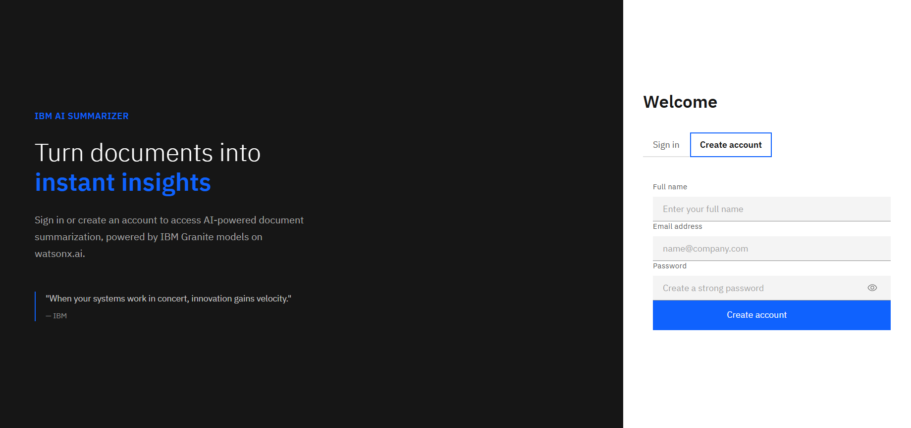

When a user accesses the application for the first time, they are directed to the **Login / Register** page. Clicking **Create account** reveals the registration form on the right panel.

The registration form requires:
- **Full name** — the user's display name
- **Email address** — used as the unique login identifier
- **Password** — must meet all security requirements enforced in real time:
  - Minimum 8 characters
  - At least one uppercase letter
  - At least one lowercase letter
  - At least one number
  - At least one special character

A real-time **password strength indicator** provides visual feedback for each rule as the user types. Passwords are hashed with **bcrypt** before being stored — the raw password is never persisted or returned by any API endpoint.

---

### 2. Login

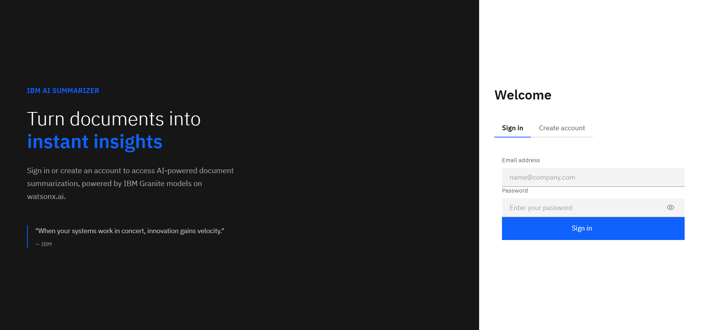

Returning users select the **Sign in** tab on the same page. The login form requires:
- **Email address**
- **Password**

On success, the user session is persisted in `localStorage` and the user is redirected to the home page. For security, the API returns a generic error for both wrong email and wrong password, preventing account enumeration.

---

### 3. Home — Hero Section

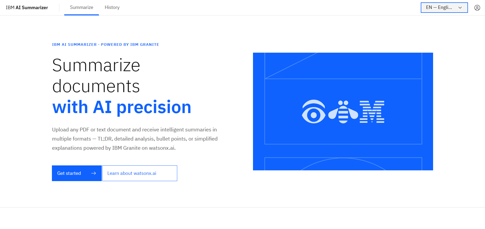

After logging in, the user lands on the **Home page**. The hero section features:
- IBM Carbon navigation header with **Summarize** and **History** links
- Language selector dropdown (English / Português / Español) in the top-right corner
- A user avatar icon that links to the Profile page
- The IBM brand image displayed on an IBM blue background panel
- A **Get started** primary button that scrolls to the upload section
- A **Learn about watsonx.ai** secondary button linking to IBM's official page

The headline *"Summarize documents with AI precision"* establishes the application's purpose at a glance.

---

### 4. Document Upload

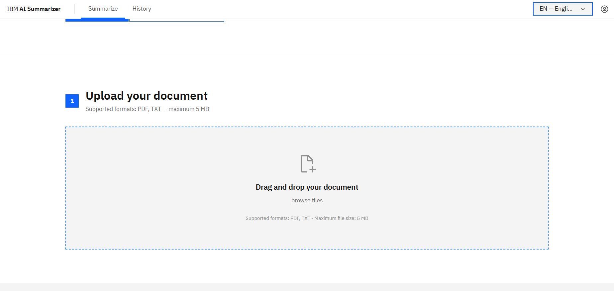

Scrolling down reveals **Step 1: Upload your document**. The upload area is a large drag-and-drop zone with:
- Visual dashed blue border indicating a droppable target
- A document icon centered in the zone
- **"Drag and drop your document"** instruction with a **browse files** link for manual selection
- Accepted formats: **PDF** and **TXT**
- Maximum file size: **5 MB** (client-side), configurable server-side via `MAX_FILE_SIZE`

The upload section is labeled with a numbered step indicator (`1`) using IBM blue, following IBM Carbon's progressive disclosure pattern.

---

### 5. Summary Modes

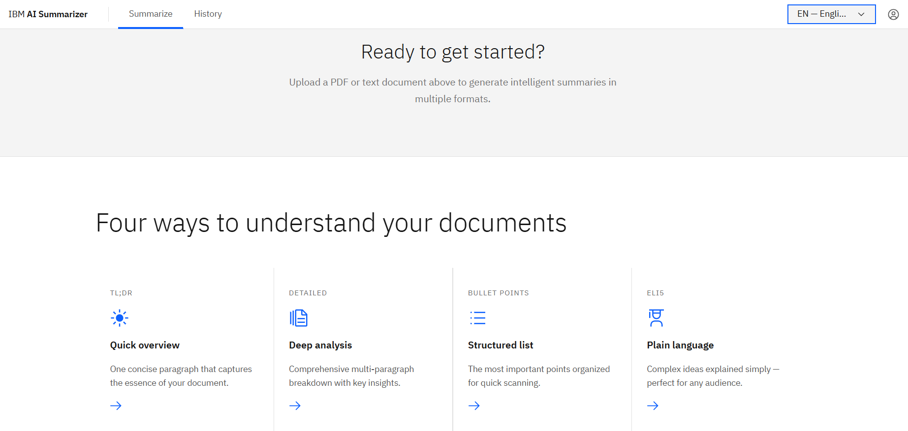

Below the upload zone, the page presents **"Four ways to understand your documents"** — a four-column capabilities grid:

| Icon | Mode | Description |
|------|------|-------------|
| Flash | **TL;DR** | One concise paragraph that captures the essence of your document |
| Document | **Detailed** | Comprehensive multi-paragraph breakdown with key insights |
| List | **Bullet Points** | The most important points organized for quick scanning |
| Education | **ELI5** | Complex ideas explained simply — perfect for any audience |

Each card includes an IBM blue icon, a mode name, a short description, and an arrow link. All icons use [Lucide React](https://lucide.dev/) with IBM Carbon color treatment.

---

### 6. Footer & Navigation

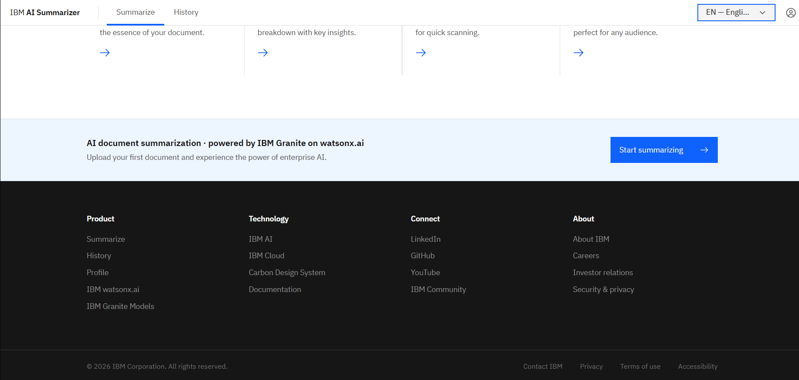

The page footer follows IBM's standard 4-column layout:

| Product | Technology | Connect | About |
|---------|------------|---------|-------|
| Summarize | IBM AI | LinkedIn | About IBM |
| History | IBM Cloud | GitHub | Careers |
| Profile | Carbon Design System | YouTube | Investor relations |
| IBM watsonx.ai | Documentation | IBM Community | Security & privacy |
| IBM Granite Models | | | |

Internal links (Summarize, History, Profile) use React Router for client-side navigation. External links open in a new tab. Above the footer columns, a **call-to-action banner** reads *"AI document summarization · powered by IBM Granite on watsonx.ai"* with a **Start summarizing** button.

---

### 7. Uploading a Document

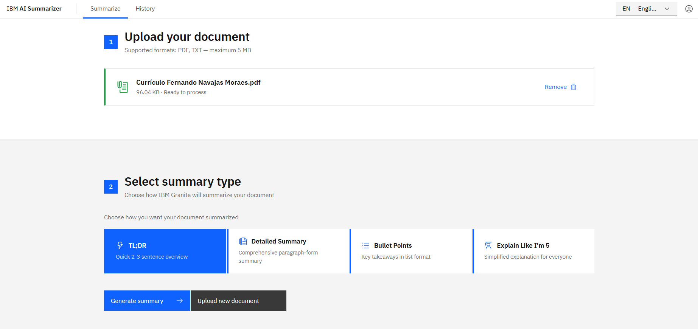

After selecting a file, the upload zone transitions to show the uploaded document card with:
- The file name and size (e.g., `document.pdf · 56.6 kB`)
- Status indicator: **Ready to process**
- A **Remove** button to clear the selection and start over

Below the uploaded file, **Step 2: Select summary type** appears automatically. The four summary mode tiles are displayed as selectable cards:
- **TL;DR** — Quick 2–3 sentence summary *(selected by default)*
- **Detailed Summary** — Comprehensive paragraph-form summary
- **Bullet Points** — Key takeaways in list format
- **Explain Like I'm 5** — Simplified explanation for everyone

At the bottom, two action buttons appear:
- **Generate summary** (primary, IBM blue) — triggers AI processing
- **Upload new document** (secondary) — resets the flow

---

### 8. Generating a Summary

Once the user clicks **Generate summary**, the application:
1. Uploads the document to the backend (multipart/form-data)
2. The server extracts text using `pdf-parse` (PDF) or UTF-8 decode (TXT)
3. Sends the document text and selected mode to **IBM Granite 3 8B Instruct** via watsonx.ai with a mode-specific prompt
4. A loading state is displayed while the AI processes the request (up to 30s timeout)
5. On completion, a success toast notification appears and the result is rendered

IBM Cloud IAM tokens are cached server-side (5-minute buffer before expiry) to avoid redundant authentication requests.

---

### 9. Summary Result

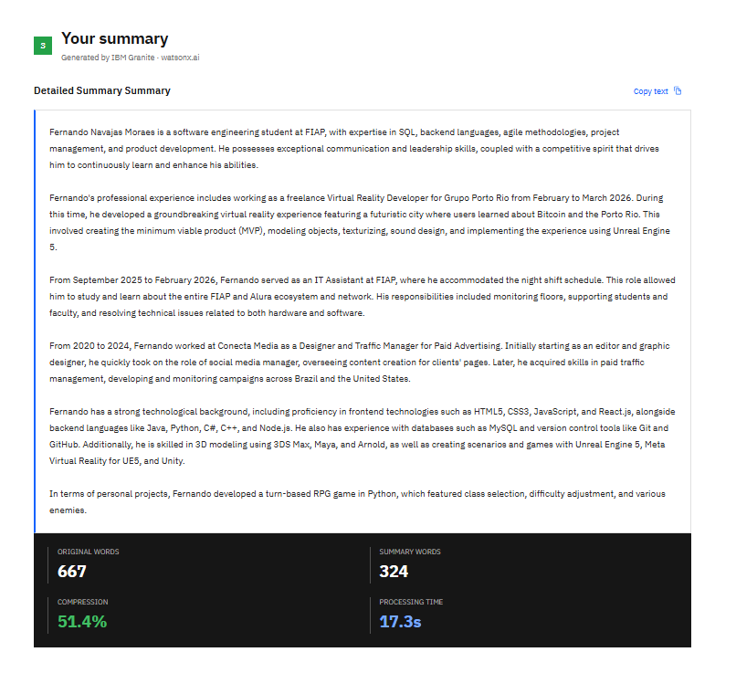

The generated summary is displayed in a dedicated result panel titled **"Your summary"**. The content area shows the full AI-generated text with mode-appropriate formatting (paragraphs for Detailed, bullet list for Bullet Points).

At the bottom of the result panel, four statistics are shown:

| Metric | Example Value |
|--------|---------------|
| Original words | 667 |
| Summary words | 324 |
| Compression | 51.4% |
| Processing time | 17.3s |

A **Copy** button lets users copy the full summary text to the clipboard. These metrics give users a transparent view of the summarization quality and AI performance.

---

### 10. Summary History

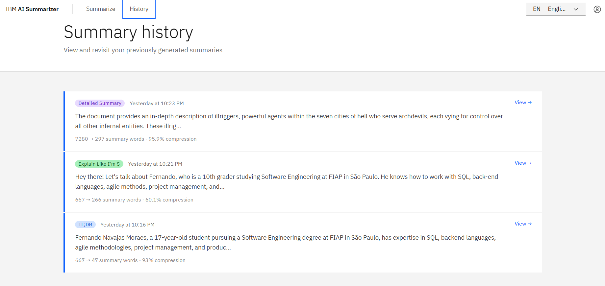

Navigating to **History** via the top navigation bar loads the **Summary history** page. This page lists all summaries generated by the logged-in user, each displayed as a card row with:
- **Mode tag** (color-coded: blue for Detailed, teal for Bullet Points, etc.)
- **Date and time** the summary was generated (relative format: "Today", "Yesterday", "3 days ago")
- **Preview text** — first ~200 characters of the summary
- **Word count stats** — original → summary words with compression percentage
- **View →** link on the right

History entries are loaded from both the server store and the current session, then merged and deduplicated.

---

### 11. History Detail Modal

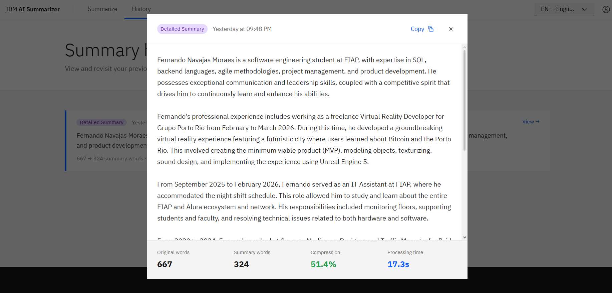

Clicking **View** on any history card opens a **full-screen modal overlay** with:
- The mode tag and generation timestamp in the header
- A **Copy** button to copy the full summary text to the clipboard
- A **close (×)** button in the top-right corner
- The complete summary text rendered in a scrollable body area (with bullet-point formatting preserved)
- A statistics footer showing: **Original words**, **Summary words**, **Compression %**, and **Processing time**

The modal is rendered via `createPortal` above all page content and closes when clicking outside the modal boundary or the close button.

---

### 12. Profile — Account Information

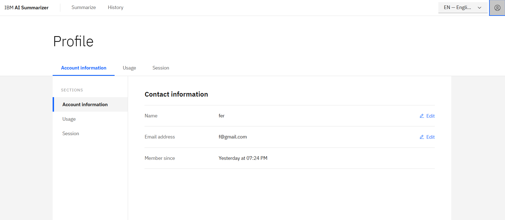

Clicking the user avatar icon in the top-right corner navigates to the **Profile** page. The page uses a two-panel layout with:
- A **tab bar** at the top: Account information · Usage · Session
- A **sidebar** on the left for direct section navigation
- A **main content area** on the right

The **Account information** tab displays the user's contact details in a structured table:

| Field | Value |
|-------|-------|
| Name | Displayed with an Edit button |
| Email address | Displayed with an Edit button |
| Member since | Account creation date |

Clicking **Edit** on any row opens an inline form (TextInput fields) pre-populated with the current values. Changes are saved via a `PUT /api/users/:userId` call and the updated user is persisted back to `localStorage`.

---

### 13. Profile — Usage

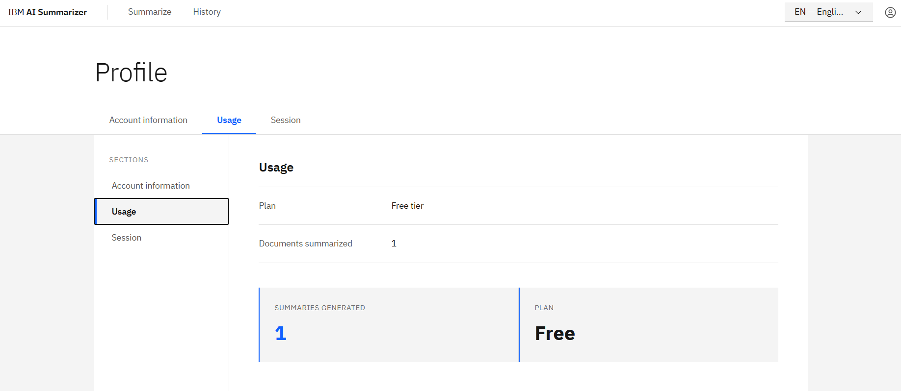

The **Usage** tab provides a summary of the user's activity:

- **Plan** — Free tier
- **Documents summarized** — Total count of summaries generated by the user

Two metric cards display:
- **SUMMARIES GENERATED** — shown in IBM blue (e.g., `1`)
- **PLAN** — shown in bold (e.g., `Free`)

These cards follow IBM Carbon's data visualization style with a left blue border accent.

---

### 14. Profile — Session

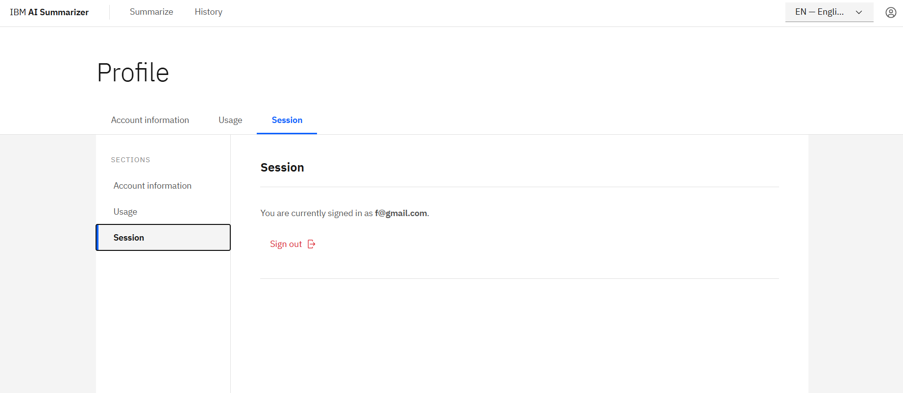

The **Session** tab shows the currently authenticated user's email address and provides a **Sign out** button rendered in IBM's `danger--ghost` style (red text with logout icon).

Clicking **Sign out**:
1. Clears the user session from `localStorage`
2. Resets all in-memory summary and document state (via `SummaryContext.clearAll()`)
3. Redirects to the `/login` page

---

## Technology Stack

### Frontend

| Library | Version | Purpose |
|---------|---------|---------|
| React | 19.2.4 | UI framework |
| IBM Carbon React (`@carbon/react`) | 1.104.1 | Component library and design tokens |
| IBM Carbon Styles (`@carbon/styles`) | 1.103.0 | Design system CSS |
| IBM Plex | — | Typography (Sans, Mono, Serif) |
| Tailwind CSS | 4.2.2 | Utility CSS (custom IBM color palette) |
| Vite | 8.0.1 | Build tool with Fast Refresh |
| React Router DOM | 7.14.0 | Client-side navigation |
| i18next + react-i18next | 26.0.3 / 17.0.2 | Internationalization (EN / PT / ES) |
| react-dropzone | 15.0.0 | Drag-and-drop file upload |
| Lucide React | 1.7.0 | Icon library |
| react-hot-toast | 2.6.0 | Toast notifications |
| Axios | 1.14.0 | HTTP client with interceptors |

### Backend

| Library | Version | Purpose |
|---------|---------|---------|
| Node.js | 18.0.0+ | Runtime |
| Express | 4.18.2 | Web framework |
| bcryptjs | 3.0.3 | Password hashing (10 salt rounds) |
| Multer | 1.4.5-lts.1 | Multipart file upload (memory storage) |
| pdf-parse | 1.1.1 | PDF text extraction |
| uuid | 9.0.1 | Unique ID generation |
| Axios | 1.14.0 | IBM watsonx.ai / IAM API calls |
| cors | 2.8.5 | Cross-origin resource sharing |
| dotenv | 16.4.5 | Environment variable loading |
| nodemon | 3.0.2 | Dev auto-restart |

### AI

- **IBM watsonx.ai** — Enterprise AI platform
- **IBM Granite 3 8B Instruct** (`ibm/granite-3-8b-instruct`) — Language model used for text summarization
- **IBM Cloud IAM** — Token-based authentication with 5-minute cache buffer

---

## Project Structure

```
DesafioTecnico_IBM/
├── client/                             # React frontend (Vite)
│   ├── vite.config.js
│   ├── tailwind.config.js              # IBM custom color palette
│   ├── .env                            # VITE_API_URL
│   └── src/
│       ├── main.jsx                    # App entry point
│       ├── App.jsx                     # Router setup (React Router v7)
│       ├── i18n.js                     # i18next configuration
│       ├── index.css
│       ├── assets/                     # Images and static assets
│       ├── pages/
│       │   ├── LoginPage.jsx           # Login + Register (tabbed, password strength)
│       │   ├── HomePage.jsx            # Upload + Generate 3-step flow
│       │   ├── HistoryPage.jsx         # Summary history with detail modal
│       │   └── ProfilePage.jsx         # Account info, usage, session tabs
│       ├── context/
│       │   ├── UserContext.jsx         # Auth state (login, logout, register, update)
│       │   └── SummaryContext.jsx      # Summary & document state and history
│       ├── components/
│       │   ├── layout/
│       │   │   ├── Layout.jsx          # Shell wrapper (Header + Outlet + Footer)
│       │   │   ├── Header.jsx          # IBM Carbon Header + language selector
│       │   │   └── Footer.jsx          # 4-column IBM-style footer
│       │   ├── upload/
│       │   │   └── FileUpload.jsx      # react-dropzone drag-and-drop widget
│       │   ├── summary/
│       │   │   ├── SummaryDisplay.jsx  # Summary result + stats + copy button
│       │   │   └── SummaryModeSelector.jsx  # 4 selectable mode cards
│       │   └── common/
│       │       ├── Button.jsx
│       │       ├── Card.jsx
│       │       ├── ErrorMessage.jsx
│       │       └── LoadingSpinner.jsx
│       ├── services/
│       │   ├── api.js                  # Axios instance (auto-extract data, error normalization)
│       │   ├── userService.js          # User CRUD + login API calls
│       │   ├── documentService.js      # Document upload + fetch API calls
│       │   └── summaryService.js       # Summary generate + list + delete API calls
│       ├── utils/
│       │   ├── constants.js            # SUMMARY_MODES, MAX_FILE_SIZE, STORAGE_KEYS
│       │   ├── formatters.js           # Date, number, compression, word-count helpers
│       │   └── fileValidation.js       # MIME type + size validation, formatFileSize
│       └── locales/
│           ├── en.json                 # English (~196 keys across 13 sections)
│           ├── pt.json                 # Portuguese (full translation)
│           └── es.json                 # Spanish (full translation)
│
└── server/                             # Express backend
    ├── server.js                       # Entry point: loads env, starts HTTP server
    ├── .env                            # Secrets (not committed)
    ├── .env.example                    # Template with all required variables
    └── src/
        ├── app.js                      # Express setup: middleware, routes, error handler
        ├── config/
        │   ├── cors.config.js          # CORS origin / methods / headers
        │   ├── multer.config.js        # Memory storage, file filter, size limit
        │   └── watsonx.config.js       # API key, project ID, model ID, parameters
        ├── routes/
        │   ├── index.js                # Health check + mount /users, /documents, /summaries
        │   ├── user.routes.js
        │   ├── document.routes.js
        │   └── summary.routes.js
        ├── controllers/
        │   ├── user.controller.js      # Register, login, get, update, list
        │   ├── document.controller.js  # Upload & parse, get, list, delete
        │   └── summary.controller.js   # Generate, get, list, modes, delete
        ├── services/
        │   ├── watsonx.service.js      # IBM Granite integration + IAM token cache
        │   ├── storage.service.js      # In-memory Maps (users, documents, summaries)
        │   └── fileParser.service.js   # PDF (pdf-parse) and TXT text extraction
        ├── middleware/
        │   ├── validateRequest.js      # Input validation (user creation, summary gen, file)
        │   ├── errorHandler.js         # Global error handler (413, 400, 404, 502, 500)
        │   └── logger.js               # Request/response logger (method, path, status, ms)
        └── utils/
            ├── constants.js            # SUMMARY_MODES, HTTP_STATUS, ERROR_CODES
            ├── helpers.js              # countWords, cleanText, validateEmail, createResponse
            └── prompts.js              # Mode-specific prompt templates + model parameters
```

---

## Quick Start

### Prerequisites

- Node.js 18 or higher
- npm
- IBM Cloud account with watsonx.ai access and a provisioned project

### 1. Clone and install dependencies

```bash
# Backend
cd server
npm install

# Frontend
cd ../client
npm install
```

### 2. Configure environment variables

Copy the example file and fill in your credentials:

```bash
cp server/.env.example server/.env
```

**`server/.env`**
```env
# Required
WATSONX_API_KEY=your_ibm_cloud_api_key_here
WATSONX_PROJECT_ID=your_watsonx_project_id_here

# Optional (defaults shown)
WATSONX_URL=https://us-south.ml.cloud.ibm.com
WATSONX_MODEL_ID=ibm/granite-3-8b-instruct
PORT=5000
NODE_ENV=development
CORS_ORIGIN=http://localhost:5173
MAX_FILE_SIZE=10485760
ALLOWED_FILE_TYPES=application/pdf,text/plain
```

**`client/.env`**
```env
VITE_API_URL=http://localhost:5000/api
```

### 3. Start the servers

```bash
# Terminal 1 — Backend
cd server
npm run dev

# Terminal 2 — Frontend
cd client
npm run dev
```

Access the application at **http://localhost:5173**

The server startup banner will list all available endpoints and confirm watsonx.ai configuration status.

---

## API Reference

**Base URL:** `http://localhost:5000/api`

### Health

| Method | Endpoint | Description |
|--------|----------|-------------|
| `GET` | `/health` | Returns status, timestamp, and version |

### Users

| Method | Endpoint | Body | Description |
|--------|----------|------|-------------|
| `POST` | `/users` | `{ name, email, password }` | Register a new user |
| `POST` | `/users/login` | `{ email, password }` | Authenticate and return user |
| `GET` | `/users/:userId` | — | Get user profile (no passwordHash) |
| `PUT` | `/users/:userId` | `{ name?, email? }` | Update profile fields |
| `GET` | `/users` | — | List all users (debug) |

### Documents

| Method | Endpoint | Body | Description |
|--------|----------|------|-------------|
| `POST` | `/documents/upload` | `multipart/form-data` (file + userId) | Upload and parse a document |
| `GET` | `/documents/:documentId` | — | Get document with full text content |
| `GET` | `/documents/user/:userId` | — | List user documents (no text content) |
| `DELETE` | `/documents/:documentId` | — | Delete document and cascade-delete its summaries |

### Summaries

| Method | Endpoint | Body | Description |
|--------|----------|------|-------------|
| `POST` | `/summaries/generate` | `{ documentId, mode, userId }` | Generate a summary via IBM Granite |
| `GET` | `/summaries/modes` | — | Return available modes with descriptions |
| `GET` | `/summaries/user/:userId` | — | List all summaries for a user (with pagination) |
| `GET` | `/summaries/:summaryId` | — | Retrieve a single summary |
| `GET` | `/summaries/document/:documentId` | — | List summaries for a specific document |
| `DELETE` | `/summaries/:summaryId` | — | Delete a summary |

### Summary Modes (valid values for `mode`)

| Value | Label |
|-------|-------|
| `TLDR` | TL;DR |
| `DETAILED` | Detailed Summary |
| `BULLETS` | Bullet Points |
| `ELI5` | Explain Like I'm 5 |

---

## Environment Variables

| Variable | Where | Default | Description |
|----------|-------|---------|-------------|
| `WATSONX_API_KEY` | server | — | IBM Cloud API key (**required**) |
| `WATSONX_PROJECT_ID` | server | — | watsonx.ai project ID (**required**) |
| `WATSONX_URL` | server | `https://us-south.ml.cloud.ibm.com` | IBM regional endpoint |
| `WATSONX_MODEL_ID` | server | `ibm/granite-3-8b-instruct` | Granite model identifier |
| `PORT` | server | `5000` | Express server port |
| `NODE_ENV` | server | `development` | Environment (`development` / `production`) |
| `CORS_ORIGIN` | server | `http://localhost:5173` | CORS allowed origin |
| `MAX_FILE_SIZE` | server | `10485760` (10 MB) | Maximum upload size in bytes |
| `ALLOWED_FILE_TYPES` | server | `application/pdf,text/plain` | Comma-separated MIME types |
| `VITE_API_URL` | client | `http://localhost:5000/api` | Backend API base URL |

---

## Security Notes

- Passwords hashed with **bcrypt** (10 salt rounds) before storage — never stored or returned in plain text
- The `passwordHash` field is stripped from all API responses by `StorageService`
- Login returns a generic error for both wrong email and wrong password (prevents account enumeration)
- API keys stored in `.env` files — never committed to version control (`.gitignore` enforced)
- File type and size validated **server-side** on every upload request (Multer + `validateFileUpload` middleware)
- CORS configured to allow only the specified `CORS_ORIGIN` origin
- Express configured with `trust proxy: 1` for reverse proxy deployments
- Body size limited to 10 MB for JSON and URL-encoded payloads

---

## Known Limitations

- **In-memory storage** — all data (users, documents, summaries) is lost when the server restarts (no persistent database)
- No email verification flow
- No password reset / forgot password flow
- Supported file types limited to PDF and TXT
- No authentication token/JWT — session is managed entirely via `localStorage`
- Designed for local development deployment (not hardened for production)
- Text content sent to watsonx.ai is truncated at **8,000 words** per request

---

## Acknowledgments

- **IBM watsonx.ai** — AI platform and Granite language model
- **IBM Carbon Design System** — Component library and design language
- **React** — Frontend framework
- **Express** — Backend framework

---

*Last updated: April 2026*
